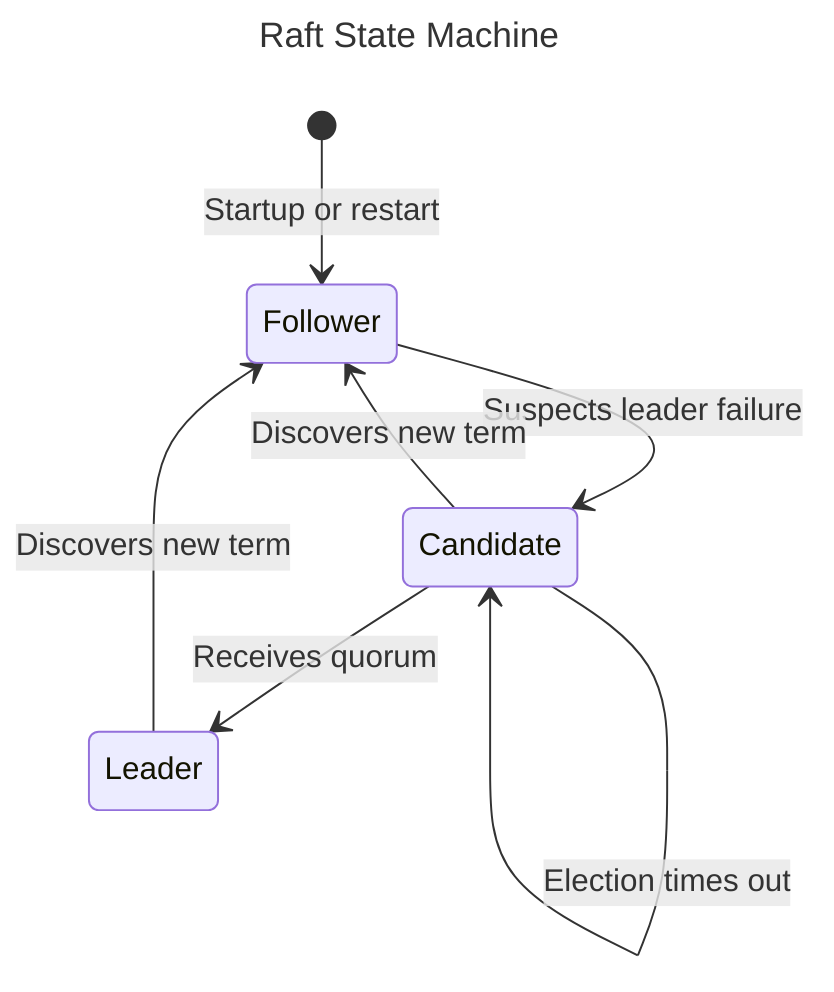

# Distributed Day Trading Service using Raft Consensus Algorithm

## Overview

This project implements a simple distributed day trading service with the core goal of using the Raft consensus algorithm to ensure consistency across a distributed system.

Kotlin is used for the implementation of the service, and gRPC is used for the communication between the distributed servers, and between the client and the servers.

### Raft Consensus Algorithm
At a high-level, the system will consist of a set of servers that will be responsible for maintaining a replicated log of client requests. 
The servers will use the Raft consensus algorithm to ensure that the logs are consistent across all servers. 
The leader node is responsible for communicating with the client and replicating the log across all other nodes.

The implementation of the Raft state machine can be found in [`RaftStateMachine.kt`](app/src/main/kotlin/cs416/lambda/capstone/state/RaftStateMachine.kt),
with the implementation of each specific state, event, and action being in [`Node.kt`](app/src/main/kotlin/cs416/lambda/capstone/Node.kt).

---

## Running Simulated Environment with Docker Compose

1. Install docker. You can find the instructions for your OS here: https://docs.docker.com/get-docker/
2. Build the repository (generates the jar file) with `./gradlew build`
3. Create a Docker image with the jar file with the following command: `docker build -t raft-trading-server:latest .`
4. Run the simulated environment with 3 containers representing 3 separate raft nodes: `docker compose up -d`
   - Note that the `-d` flag is use for running in daemon thread. You definitely *WANT* to do this, especially on compose,
    since if you don't include it, the container(s) will be tied to the terminal session in which it was called, 
    and will stop if you hit ^C or close the window. 

### Observing the Raft Algorithm
**Docker Desktop** and **Intellij IDEA** are great applications for observing the logs of each Docker container (representing a single Raft node) and the progress of the Raft algorithm.

### Simulating Client Requests
**Postman** can be used to send client requests to the leader node over gRPC. To do this, you will need to import the [`trade.proto`](app/src/main/proto/trade.proto) file so you can access the gRPC methods.
Note that we use port forwarding to access the gRPC server running on the Docker container from you local device. The port forwarding is defined in the [`docker-compose.yml`](docker-compose.yml) file.

### Modifying Number of Nodes Running in the Raft Cluster
The number of nodes (Docker containers) used by the Raft can easily be changed by adding additional services to the [`docker-compose.yml`](docker-compose.yml) file
and updating the `config.json` with the new node information.

---

## Next Steps
- [ ] Support dynamic membership changes (Section 6 of Raft paper) (i.e. adding/removing nodes from the cluster)

- [ ] Implement snapshotting and sharing of snapshots between nodes (Section 7 of Raft paper)

‼️ _Note that this repository is for educational purpose and should not be used in production!_ 

---

## References
- [In Search of an Understandable Consensus Algorithm
  (Extended Version)](https://raft.github.io/raft.pdf)
- [Raft Kotlin](https://github.com/AChepurnoi/raft-kotlin)
